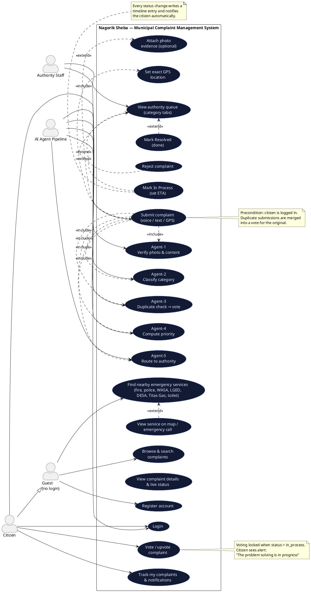

# Nagorik Sheba — UML Use Case Diagram

## How to view

- Open `use-case-diagram.html` in any browser → high-resolution diagram, Ctrl+P to save as PDF for your report.
- Or paste the PlantUML code below into https://www.plantuml.com/plantuml or https://www.planttext.com

---

## PlantUML Source

---

## Actor summary

| Actor | Description | Main goal |
|---|---|---|
| **Guest** | Any person using the app without an account | Find emergency services, browse complaints |
| **Citizen** | Registered user (inherits all Guest use cases) | Submit complaints, vote, track progress |
| **Authority Staff** | Employee of a City Corp / Pouroshova / Union Parishad | Process the authority's complaint queue |
| **AI Agent Pipeline** | Internal system actor (Agents 1–5) | Verify, classify, de-duplicate, prioritize, route |

## Key use case descriptions (for your report)

### UC7 — Submit Complaint
| | |
|---|---|
| **Actors** | Citizen (primary), Agent Pipeline (secondary) |
| **Precondition** | Citizen is logged in |
| **Main flow** | 1. Citizen enters title + description (types OR dictates by voice) · 2. Optionally attaches a photo · 3. Pins exact GPS on map · 4. Submits |
| **Agent flow** | Agent-1 verifies content → Agent-2 classifies category → Agent-3 scans 250 m GPS radius → Agent-4 scores priority → Agent-5 routes to matching authority |
| **Alternate flows** | A1: Content fails verification → complaint rejected, citizen notified. A2: Similar active complaint exists nearby → submission merged, counted as a vote on the original. A3: Original already in_process → blocked with alert *"The problem solving is in progress"* |
| **Postcondition** | Complaint stored with status `verified` (or `merged`/`rejected`), routed to an authority, visible in public search |

### UC10 — Vote / Upvote Complaint
| | |
|---|---|
| **Actor** | Citizen |
| **Precondition** | Complaint is `submitted`/`verified`; voter is not the owner; hasn't voted before |
| **Flow** | Citizen searches, opens complaint, taps Upvote → vote stored (UNIQUE per user per complaint), priority rescored by Agent-4, owner notified |
| **Alternate** | Complaint `in_process` → alert *"The problem solving is in progress"*, voting locked |

### UC18/UC19 — Staff labels complaint
| | |
|---|---|
| **Actor** | Authority Staff |
| **Precondition** | Staff logged in; complaint belongs to their authority |
| **Flow** | Open priority-ranked queue (filter by category/status) → Mark *In Process* with ETA hours (or *Resolved* / *Reject*) |
| **Postcondition** | Status + timeline entry saved; citizen receives notification with ETA; complaint locked from further votes/submissions while in process |

### UC1 — Find Nearby Emergency Services (public)
| | |
|---|---|
| **Actor** | Guest (no login required) |
| **Flow** | Browser/device GPS captured → backend returns fire service, police, WASA, LGED, DESA, Titas Gas, public toilets sorted by distance → view on dark map, tap to call |
